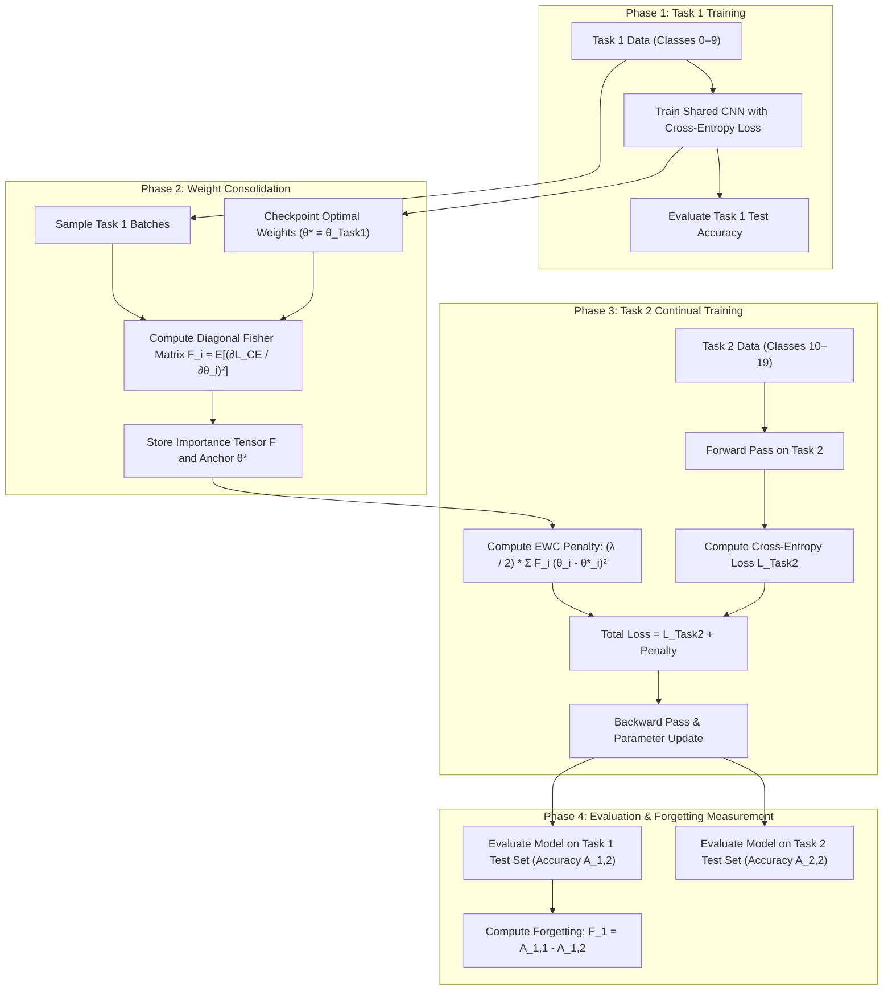

# Elastic Weight Consolidation (EWC) Guide

**Project:** Online Learning – The Human Way  
**Author:** Tuong (EWC Research Notes & Method Plan)  
**Deliverable:** Week 1 Research Guide & Implementation Plan  
**Context:** CIFAR-100 Continual Learning (Task 1: classes 0–9, Task 2: classes 10–19)

---

## 1. Introduction & Purpose

This guide provides the foundational theory, algorithmic workflow, mathematical formulation, and experimental rationale for **Elastic Weight Consolidation (EWC)**. It serves as:
1. An onboarding document for the team before implementing standard EWC in Week 2.
2. A formal methods reference for our semester technical report and poster.
3. A clear comparison between canonical EWC and recent advances such as **EWC-DR (EWC Done Right)**.

---

## 2. Catastrophic Forgetting in Simple Words

### What is Catastrophic Forgetting?
**Catastrophic forgetting** (also known as catastrophic interference) is a fundamental problem in artificial neural networks where a model **abruptly and drastically loses its ability to perform previously learned tasks when trained on new tasks**.

Imagine a human learning how to ride a bicycle. After becoming proficient at cycling, they learn how to drive a car. A normal human retains both skills. In contrast, a standard artificial neural network trained first on cycling and then on driving would abruptly forget how to ride a bicycle entirely—its accuracy on cycling would plummet to near zero as soon as it masters driving.

In our semester project:
- The network first learns **Task 1** (CIFAR-100 classes 0–9, such as beaver, dolphin, otter).
- The network then learns **Task 2** (CIFAR-100 classes 10–19, such as orchid, poppy, rose).
- Under standard sequential training, the network's accuracy on classes 0–9 collapses as it adapts to classes 10–19.

---

## 3. Why Normal Sequential Training Hurts Older Tasks

Standard deep learning models trained with Stochastic Gradient Descent (SGD) or Adam suffer from catastrophic forgetting due to three core architectural and optimization factors:

### 3.1. Distributed Parameter Representations
In a neural network, knowledge is not stored in isolated memory addresses or discrete "files." Instead, knowledge is **distributed across all shared weights and biases** across convolutional and linear layers. The same filter weights that detect edges, textures, and object parts for Task 1 are shared by all future tasks.

### 3.2. Myopic Gradient Updates
When the model transitions to Task 2:
$$\mathcal{L}_{\text{total}} = \mathcal{L}_{\text{Task 2}}(\theta)$$
The loss function depends exclusively on Task 2 data. Backpropagation computes gradients strictly to minimize classification error on classes 10–19:
$$\theta \leftarrow \theta - \eta \nabla_{\theta} \mathcal{L}_{\text{Task 2}}(\theta)$$
The optimizer adjusts weights without any awareness of whether a specific weight was crucial for classifying Task 1 images. Consequently, weights that encoded vital Task 1 decision boundaries are overwritten to satisfy the Task 2 objective.

### 3.3. Lack of Memory Consolidation
Standard training lacks an episodic memory replay mechanism or stability constraint. Without explicit regularization or data replay, the neural network exhibits total **plasticity** (the ability to adapt to new input) at the complete expense of **stability** (the ability to preserve acquired knowledge)—a dilemma known as the **stability-plasticity dilemma**.

---

## 4. Standard Elastic Weight Consolidation (EWC)

### 4.1. Synaptic Consolidation
In mammalian brains, learning is accompanied by **synaptic consolidation** (Cichon & Gan, 2015; Yang et al., 2009). When an animal masters a skill, a proportion of synapses are strengthened, forming dendritic spines that persist over long timescales. Subsequent learning of new skills selectively modifies other, less vital synapses, leaving consolidated spines intact. When these consolidated spines are experimentally erased, the old skill is lost.

EWC brings this principle to artificial neural networks: **it selectively slows down learning on weights that are critical to old tasks while allowing unimportant weights to adapt to new tasks**.

### 4.2. Utilizing Over-Parameterization
Deep neural networks are heavily over-parameterized—they have millions of parameters, meaning there are many distinct parameter configurations that achieve near-optimal performance on any given task.

Because many configurations solve Task 2, there is likely an optimal solution for Task 2 ($\theta_B^*$) that lies **in the close neighborhood** of the optimal solution for Task 1 ($\theta_A^*$).


- **Unconstrained SGD (Blue arrow):** Moves straight toward the minimum of Task B, leaving the low-error region of Task A and destroying Task 1 performance.
- **Uniform L2 Regularization / Weight Decay (Green arrow):** Penalizes changes to all weights equally. This is too rigid: it severely restricts the network's plasticity, preventing it from learning Task B well.
- **EWC (Red arrow):** Attaches a virtual **elastic spring** to each weight anchoring it to its Task 1 value ($\theta_{A}^*$). Crucially:
  - **Important weights for Task 1:** Get **stiff, rigid springs** (high resistance to change).
  - **Unimportant weights for Task 1:** Get **soft, loose springs** (or no resistance), allowing them to freely adjust to minimize Task 2 loss.

### 4.3. Step-by-Step Actions of Standard EWC
1. **Train on Task 1:** Train the network on Task 1 (classes 0–9) until convergence using standard cross-entropy loss.
2. **Save Task 1 Model Weights:** Freeze and store the trained parameter values as optimal reference points $\theta^*$.
3. **Estimate Weight Importance:** Compute the importance score $F_i$ for every parameter $i$ on Task 1 training data using the diagonal of the Fisher Information Matrix.
4. **Train Task 2 with EWC Penalty:** Train on Task 2 (classes 10–19) using a composite loss that combines Task 2 cross-entropy with a quadratic penalty pulling important weights back toward $\theta^*$.

---

## 5. EWC Mathematical Formulation

During Task 2 training, EWC minimizes the following total objective function:

```text
total_loss = new_task_loss + (lambda / 2) * sum(F_i * (theta_i - theta_star_i)^2)
```

In standard mathematical notation:

$$\mathcal{L}(\theta) = \mathcal{L}_{\text{Task 2}}(\theta) + \sum_{i} \frac{\lambda}{2} F_i (\theta_i - \theta_{1, i}^*)^2$$

### 5.1. Definition and explanation of each component

| Term | Symbol / Code | Exact Meaning |
|---|---|---|
| **New Task Loss** | $\mathcal{L}_{\text{Task 2}}(\theta)$ / `new_task_loss` | The standard cross-entropy classification loss evaluated on the current incoming batch of Task 2 data (classes 10–19). This term drives the model to acquire new capabilities. |
| **Old Parameter Anchor** | $\theta_{1, i}^*$ / `theta_star_i` | The optimal value of parameter $i$ obtained at the end of Task 1 training and subsequently **frozen**. It serves as the anchor point toward which the weight is pulled. |
| **Current Parameter** | $\theta_i$ / `theta_i` | The active, trainable value of parameter $i$ during Task 2 training. Updated by backpropagation at each step. |
| **Parameter Importance** | $F_i$ / `F_i` | The $i$-th diagonal element of the **Fisher Information Matrix (FIM)** computed on Task 1 data after Task 1 training. Measures how sensitive the Task 1 predictions are to small perturbations in parameter $\theta_i$. |
| **Consolidation Strength** | $\lambda$ / `lambda` | A global hyperparameter controlling the strength of the quadratic penalty. It sets how strongly EWC protects old knowledge relative to acquiring new knowledge. |
| **Factor of $1/2$** | $\frac{1}{2}$ | Normalization factor ensuring the gradient of the penalty is simply $\lambda F_i (\theta_i - \theta_{1, i}^*)$, directly analogous to physical spring potential energy $E = \frac{1}{2} k \Delta x^2$ and Gaussian log-posterior precision. |

### 5.2. Bayesian Grounding: Laplace Approximation
Formally, EWC is grounded in Bayesian probability (Kirkpatrick et al., 2017). By Bayes' rule, the posterior distribution over parameters given both tasks $\mathcal{D} = \{\mathcal{D}_1, \mathcal{D}_2\}$ is:
$$\log p(\theta | \mathcal{D}) = \log p(\mathcal{D}_2 | \theta) + \log p(\theta | \mathcal{D}_1) - \log p(\mathcal{D}_2) \tag{1}$$

The true posterior after Task 1, $p(\theta | \mathcal{D}_1)$, is intractable. EWC applies the **Laplace approximation**, modeling $p(\theta | \mathcal{D}_1)$ as a multivariate Gaussian centered at the mode $\theta_1^*$ with precision (inverse covariance) approximated by the diagonal of the Fisher Information Matrix $F$:
$$p(\theta | \mathcal{D}_1) \approx \mathcal{N}\left(\theta; \theta_1^*, \text{diag}(F)^{-1}\right)$$
Taking the logarithm yields the quadratic penalty in Equation (1).

| Term | Symbol | Exact Meaning |
|---|---|---|
| **Task 1 Posterior (Prior for Task 2)** | $p(\theta \mid \mathcal{D}_1)$ | The posterior probability distribution of model parameters $\theta$ after learning Task 1. When training on Task 2, this acts as the prior distribution that protects Task 1 knowledge. |
| **Model Parameters** | $\theta$ | The vector of all trainable weights and biases across the network. |
| **Laplace Approximation** | $\approx$ | Denotes the local Gaussian approximation of the intractable true posterior around the mode $\theta_1^*$ using curvature information. |
| **Multivariate Gaussian** | $\mathcal{N}(\cdot\,; \mu, \Sigma)$ | The multivariate normal distribution parameterized by mean vector $\mu = \theta_1^*$ and covariance matrix $\Sigma = \text{diag}(F)^{-1}$. |
| **Old Parameter Anchor (Mean)** | $\theta_1^*$ | The optimal parameter vector obtained at the end of Task 1 training (the mode/peak of the posterior where Task 1 loss was minimized). |
| **Fisher Precision Matrix** | $\text{diag}(F)$ | The diagonal of the Fisher Information Matrix computed on Task 1 data. Represents the **precision** (inverse covariance) matrix; higher values indicate weights vital to Task 1. |
| **Parameter Covariance** | $\text{diag}(F)^{-1}$ | The covariance matrix $\Sigma$ of the Gaussian distribution. Higher Fisher values $F_i$ result in tighter variance $(1/F_i)$, meaning high certainty that weight $\theta_i$ should not deviate from $\theta_{1, i}^*$. |
---

## 6. EWC Execution Flow

### 6.1. Linear Step Sequence
```text
Train Task 1
→ Save Task 1 model weights (theta_star)
→ Calculate importance values (Fisher diagonal F)
→ Train Task 2 with EWC penalty
→ Test Task 1 and Task 2
```

### 6.2. Visual Workflow Diagram



---

## 7. Comparison: Standard EWC versus EWC-DR

In March 2026, Liu & Chang published *"Elastic Weight Consolidation Done Right for Continual Learning"* (arXiv:2603.18596), providing a detailed diagnosis of why standard EWC often exhibits suboptimal retention, and introducing **EWC-DR**.

### 7.1. Direct Method Comparison Table

| Attribute | Standard EWC (Kirkpatrick et al., 2017) | EWC-DR (Liu & Chang, 2026) |
|---|---|---|
| **Primary Paper** | *Overcoming catastrophic forgetting in neural networks* (PNAS 2017) | *Elastic Weight Consolidation Done Right for Continual Learning* (arXiv 2026) |
| **Core Idea** | Regularize weights using diagonal Fisher Information Matrix (FIM) of cross-entropy loss. | Rectify FIM estimation using **Logits Reversal (LR)** before computing cross-entropy gradients. |
| **FIM Gradient Formula** | $\frac{\partial \mathcal{L}_{\text{CE}}}{\partial z_c} = p_c - 1 = p_c - y_c$ | $\frac{\partial \tilde{\mathcal{L}}_{\text{CE}}}{\partial z_c} = 1 - \tilde{p}_c = y_c - \tilde{p}_c$ with $\tilde{z} = -z$ |
| **Handling Confident Predictions** | **Vulnerable to Gradient Vanishing:** As prediction confidence grows ($p_c \to 1$), the gradient $(p_c - 1) \to 0$, causing $F_i \to 0$. Highly confident, vital weights are under-protected. | **Robust Gradient Retention:** As logit $z_c$ increases, reversed probability $\tilde{p}_c \to 0$, so $(1 - \tilde{p}_c) \to 1$. Confident, vital weights receive strong, prominent protection. |
| **Protection Specificity** | Tends to under-protect parameters across the classification head and late layers due to vanishing gradients. | Highly selective: concentrates protection on the ground-truth class while keeping incorrect classes near zero. Avoids MAS-style over-protection. |
| **Implementation Complexity** | Simple: standard backpropagation of cross-entropy loss on task data. | Minimal addition: exactly one line of code to negate logits before cross-entropy: `logits_r = -logits`. |
| **CIFAR-100 Performance** | Moderate baseline retention; struggles as the number of sequential tasks grows (e.g., $A_{\text{last}} \approx 14.61\%$ on 5-task big-start). | High retention; major performance gains ($A_{\text{last}} \approx 50.23\%$ on 5-task big-start, $>55\%$ relative improvement). |
| **Replay Requirement** | Exemplar-free (no past data stored during new task training). | Exemplar-free (retains full memory efficiency and privacy benefits). |

### 7.2. The Underlying Diagnosis: Gradient Vanishing in Vanilla EWC
The core mathematical insight in Liu & Chang (2026) is as follows:

For a classification layer with logits $z$ and softmax probability $p_k = \frac{\exp(z_k)}{\sum_j \exp(z_j)}$, the cross-entropy gradient with respect to logit $z_k$ for ground-truth class $c$ is:
$$\frac{\partial \mathcal{L}_{\text{CE}}}{\partial z_k} = p_k - y_k$$

- For the correct class $k = c$: $\frac{\partial \mathcal{L}_{\text{CE}}}{\partial z_c} = p_c - 1$.
- For incorrect classes $k \neq c$: $\frac{\partial \mathcal{L}_{\text{CE}}}{\partial z_k} = p_k$.

Because the model is evaluated after Task 1 has fully converged, the model makes **highly confident, correct predictions** on Task 1 training data ($p_c \approx 0.99 \implies p_c - 1 \approx -0.01$).
Since the empirical Fisher is computed by squaring these gradients:
$$F_{w} = \mathbb{E}\left[ (p_k - y_k)^2 \cdot \left(\frac{\partial z_k}{\partial w}\right)^2 \right]$$
The factor $(p_c - 1)^2 \approx (0.01)^2 = 0.0001$ vanishes! **The weights most responsible for accurate classification receive artificially suppressed importance values.**

### 7.3. How Logits Reversal (LR) Fixes the Issue
EWC-DR simply negates the logits before the softmax operation during importance calculation:
$$\tilde{z}_k = -z_k \implies \tilde{p}_k = \frac{\exp(-z_k)}{\sum_j \exp(-z_j)}$$
The modified loss gradient becomes:
$$\frac{\partial \tilde{\mathcal{L}}_{\text{CE}}}{\partial z_c} = 1 - \tilde{p}_c$$
When the network is confident in class $c$ ($z_c \gg z_{j}$), $\tilde{p}_c$ becomes very small ($\tilde{p}_c \to 0$). Therefore, the gradient magnitude $(1 - \tilde{p}_c) \to 1$, completely preserving gradient magnitude and properly assigning high importance to the parameters that produced the confident prediction.

---

## 8. Why Implement Standard EWC First?

Our project explicitly mandates implementing **standard EWC** in Week 2, treating **EWC-DR** as an optional future extension. The rationale is grounded in sound scientific and engineering principles:

1. **Adherence to the Scientific Method:**
   Our primary research question is:
   > *"Can standard Elastic Weight Consolidation reduce catastrophic forgetting when a model learns CIFAR-100 tasks one after another?"*
   To evaluate the efficacy of any technique, one must first establish the recognized canonical baseline. Standard EWC is the universal benchmark across continual learning literature since 2017.
2. **Clear Isolation of Effects (Controlled Experiments):**
   If we immediately jumped to EWC-DR, we would not know whether our observed results stem from EWC's foundational quadratic spring constraint or from the Logits Reversal modification. Testing standard EWC first gives us an unconfounded baseline.
3. **Debugging and Reproducibility Guardrail ($\lambda = 0$ Check):**
   In standard EWC, setting $\lambda = 0$ reduces the loss identically to the sequential baseline loss ($\mathcal{L} = \mathcal{L}_{\text{new}}$). This provides an immediate, foolproof sanity check for our codebase: `train_ewc.py --ewc_lambda 0` must match `train_baseline.py`.
4. **Seamless Future Extension:**
   Because EWC-DR uses the exact same storage structures, penalty loss, and training loop as standard EWC—differing solely by `logits_r = -logits` during the Fisher accumulation step—having standard EWC completely debugged and stable makes experimenting with EWC-DR in future weeks an effortless, low-risk upgrade.

---

## 9. Academic Citations

Please use the following citations when referencing EWC and EWC-DR in project deliverables, report drafts, and presentation slides:

### Primary EWC Citation
```bibtex
@article{kirkpatrick2017overcoming,
  title={Overcoming catastrophic forgetting in neural networks},
  author={Kirkpatrick, James and Pascanu, Razvan and Rabinowitz, Neil and Veness, Joel and 
          Desjardins, Guillaume and Rusu, Andrei A and Milan, Kieran and Quan, John and 
          Ramalho, Tiago and Grabska-Barwinska, Agnieszka and Hassabis, Demis and 
          Clopath, Claudia and Kumaran, Dharshan and Hadsell, Raia},
  journal={Proceedings of the National Academy of Sciences (PNAS)},
  volume={114},
  number={13},
  pages={3521--3526},
  year={2017},
  publisher={National Acad Sciences},
  doi={10.1073/pnas.1611835114},
  eprint={1612.00796},
  archivePrefix={arXiv},
  primaryClass={cs.LG}
}
```

### Primary EWC-DR Citation
```bibtex
@article{liu2026elastic,
  title={Elastic Weight Consolidation Done Right for Continual Learning},
  author={Liu, Xuan and Chang, Xiaobin},
  journal={arXiv preprint arXiv:2603.18596v3},
  year={2026},
  eprint={2603.18596},
  archivePrefix={arXiv},
  primaryClass={cs.LG}
}
```

### Key Supporting References
- **Catastrophic Forgetting Survey:** McCloskey, M., & Cohen, N. J. (1989). *Catastrophic interference in connectionist networks: The sequential learning problem.* Psychology of Learning and Motivation, 24, 109–165.
- **Online EWC:** Schwarz, J., Czarnecki, W., Luketina, J., et al. (2018). *Progress & Compress: A scalable framework for continual learning.* ICML 2018.
- **Memory Aware Synapses (MAS):** Aljundi, R., Babiloni, F., Elhoseiny, M., Rohrbach, M., & Tuytelaars, T. (2018). *Memory Aware Synapses: Learning what (not) to forget.* ECCV 2018.
- **Synaptic Intelligence (SI):** Zenke, F., Poole, B., & Ganguli, S. (2017). *Continual learning through synaptic intelligence.* ICML 2017.